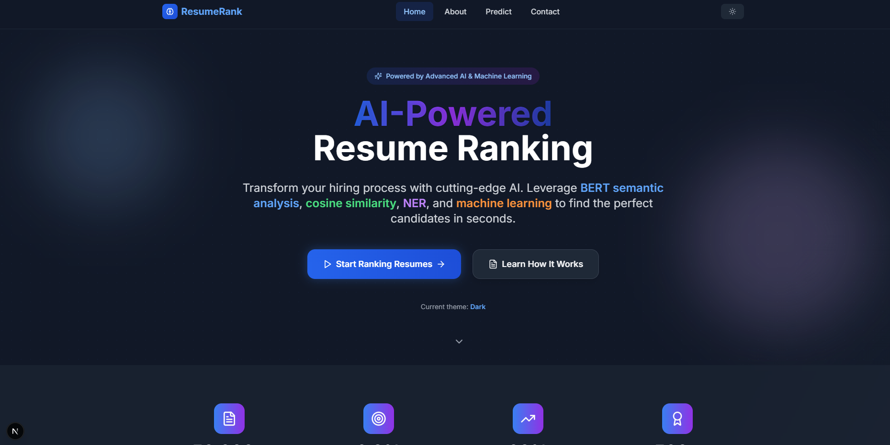
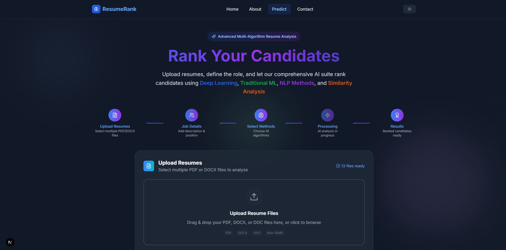
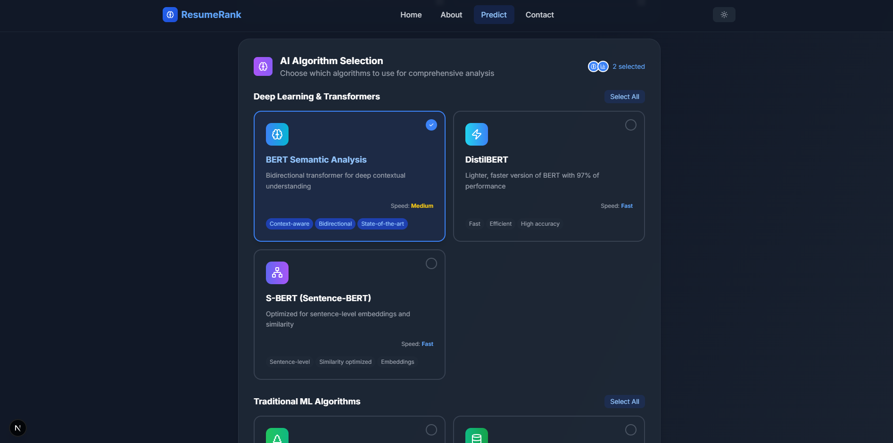
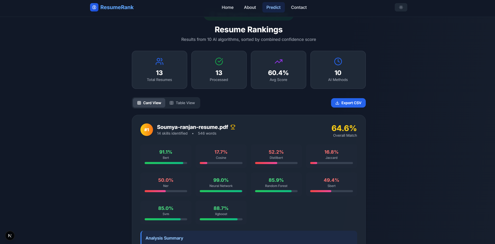
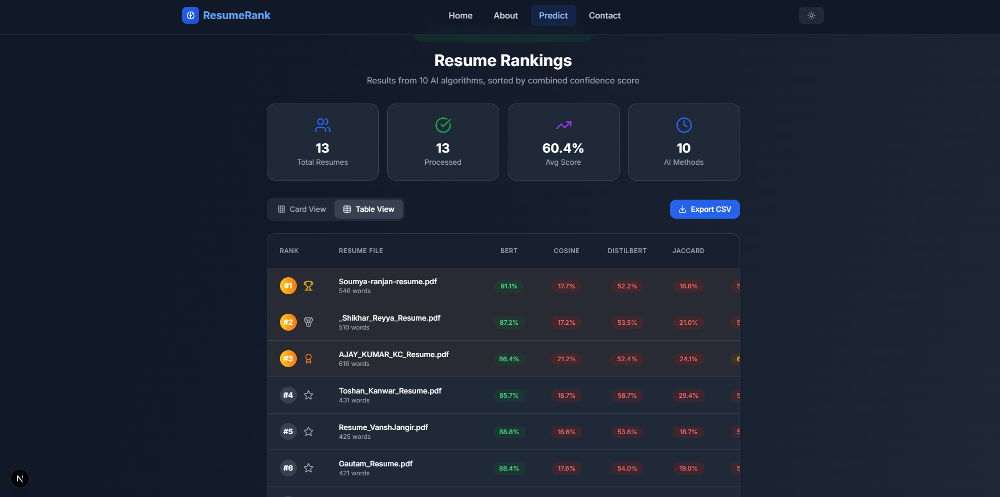

# Resume Ranking System

Full-stack application for scoring and ranking candidate resumes against a job description. The backend combines similarity metrics, NLP and NER, optional classical ML classifiers, and optional transformer-based models. Results include per-method scores, explanations, optional LLM-assisted JD expansion and narrative explanations, and lightweight batch-level fairness statistics. The API is implemented in Flask; the UI is Next.js.

## Features

- Multipart upload of multiple resumes (PDF, DOCX, DOC, TXT) with configurable size and count limits
- Parallel execution of selected scoring methods
- Ranked output with combined score, per-algorithm breakdown, and skill hints where NER or similarity details are available
- Optional Groq (Llama 3 8B) integration for structured job-description expansion and richer explanations
- CSV export via the UI or `POST /api/export-results`
- Optional academic training and evaluation workflow under `/api/academic/*`
- Legacy API at `/api/*`, extended routes at `/v2/api/*`, Prometheus-compatible metrics, rate limiting, and structured logging with request IDs

## Screenshots

| Home | Prediction |
|------|------------|
|  |  |

| Algorithm selection | Results (multi-algorithm) |
|---------------------|---------------------------|
|  |  |

| Results (table) |
|-----------------|
|  |

## Architecture

```
Client (multipart: resumes, job description, methods)
        |
        v
+-------------------+
| Request validation |  limits: app_config (file size, count, JD length)
+---------+---------+
          |
          v
+------------------+     optional: expand_jd() (Groq, cached by JD hash)
| FileProcessor     |
+---------+---------+
          |
          v
+---------------------------+
| AlgorithmManager (parallel)|
| cosine, jaccard, ner,      |
| transformers, traditional ML|
+-------------+-------------+
              |
              v
+------------------+
| Score combination |  weighted strategies (see backend/core/score_combiner.py)
+---------+---------+
          |
          v
+------------------+     optional: explain_match() (Groq) or template text
| Response assembly |
+---------+---------+
          |
          v
 Fairness fields, Prometheus metrics, X-Request-ID
```

## Algorithms (overview)

- **Cosine similarity**: Term-based vector similarity between resume and job description text.
- **Jaccard**: Set-style overlap on skills or tokens where configured.
- **NER (spaCy)**: Entity-oriented signals and extracted skill-like spans for matching and display.
- **BERT / DistilBERT / SBERT**: Encoder-based semantic similarity where enabled (models load on demand; heavy methods increase memory use).
- **XGBoost, Random Forest, SVM, Neural Network**: Optional supervised-style scorers when models are available or academic mode is used.

Default per-method weights for a weighted average are defined in `backend/core/score_combiner.py`; the API can use other combination strategies where supported.

## Prerequisites

- Python 3.11+ (see `backend/pyproject.toml`)
- [uv](https://github.com/astral-sh/uv) for Python dependencies
- Node.js 18+ for the frontend
- Sufficient RAM if enabling large transformer models (CPU-only PyTorch is supported; GPU is optional via configuration)

## Backend

```bash
cd backend
uv sync
uv sync --all-groups   # include pytest and other dev dependencies
```

Run the API (default port 5000):

```bash
uv run python app.py
```

Production-style:

```bash
uv run gunicorn app:app --workers 2 --bind 0.0.0.0:5000
```

Add packages with `uv add <package>`, not `pip install`. Legacy `backend/requirements.txt` redirects to this workflow.

**spaCy model** (if you use NER or related paths):

```bash
uv run python -m spacy download en_core_web_sm
```

Redis is optional; if unavailable, caching in the v2 blueprint degrades gracefully.

## Frontend

```bash
cd frontend
npm install
npm run dev
```

Application: [http://localhost:3000](http://localhost:3000) (ranking UI at `/predict`).

If the API is not on `http://localhost:5000`, set `NEXT_PUBLIC_API_BASE` in `frontend/.env.local`.

## API reference

| Method | Path | Description |
|--------|------|-------------|
| GET | `/api/health` | Health and algorithm inventory |
| GET | `/api/algorithms` | Algorithm metadata |
| GET | `/api/positions` | Job role presets |
| POST | `/api/process-resumes` | Rank resumes (multipart) |
| POST | `/api/rank` | Same handler as `process-resumes` |
| POST | `/api/validate-files` | Validate uploads without scoring |
| POST | `/api/export-results` | JSON body with results; CSV export |

Extended implementation (benchmarks, cache-aware paths, richer health) is also mounted under `/v2/api/...`.

## API versioning headers

- Responses under `/api/*` (excluding `/v2` prefix): `X-API-Version: legacy`
- Responses under `/v2/api/*`: `X-API-Version: v2`

## Environment variables

| Variable | Required | Description |
|----------|----------|-------------|
| `SECRET_KEY` | Recommended in production | Flask secret |
| `GROQ_API_KEY` | Optional | Enables Groq LLM features (`llama3-8b-8192` on the free tier) |
| `USE_LLM_JD_EXPANSION` | Optional (`false`) | Structured JD expansion before scoring |
| `USE_LLM_EXPLANATIONS` | Optional (`false`) | LLM-generated three-sentence explanations |
| `MAX_FILE_SIZE_MB` | Optional (`10`) | Per-file upload limit |
| `MAX_FILES_PER_REQUEST` | Optional (`10`) | Max resumes per request |
| `MAX_JD_LENGTH` | Optional (`10000`) | Max job description length (characters) |
| `RATELIMIT_ENABLED` | Optional (`true`) | Toggle Flask-Limiter |
| `PHOENIX_ENABLED` | Optional | Hint for local Arize Phoenix instrumentation |
| `DEBUG` / `FLASK_ENV` | Optional | Development vs production |
| `DEBUG_METRICS` | Optional | Set to `1` to expose `/metrics` when Flask debug reloader is on |

Central limits and feature flags live in `backend/app_config.py` (import path avoids clashing with the `config/` package).

## Tests

```bash
cd backend
uv run pytest --cov=. --cov-report=term-missing
```

## Metrics

Prometheus exposition is registered at `GET /metrics` on the API port when the app is not running with Flask’s debug reloader (or when `DEBUG_METRICS=1`). Custom series include `resume_ranking_requests_total`, `resume_ranking_latency_seconds`, `resume_ranking_score_distribution`, and `llm_expansion_calls_total`.

## Production-oriented behavior

- Batch responses may include `fairness_warning`, `score_variance`, and `score_std_dev`.
- Rate limiting via Flask-Limiter (default in-memory; configure Redis-backed storage for multi-worker deployments if needed).
- Structured JSON logging via `structlog` and `X-Request-ID` on responses.

## Docker

From the repository root:

```bash
docker compose up --build
```

The API service uses two Gunicorn workers and mounts `backend/uploads` for persistent uploads. Provide environment variables via `backend/.env` as referenced in `docker-compose.yml`.

## Contributing

1. Fork the repository and create a branch for your change.
2. Keep commits focused; match existing style and run tests for backend changes.
3. Open a pull request with a clear description of behavior and risk.

## Acknowledgments

This project builds on the broader ecosystem of open tools, including Hugging Face Transformers, Sentence Transformers, spaCy, scikit-learn, and PyTorch.

## License

See the repository’s `LICENSE` file if present.
